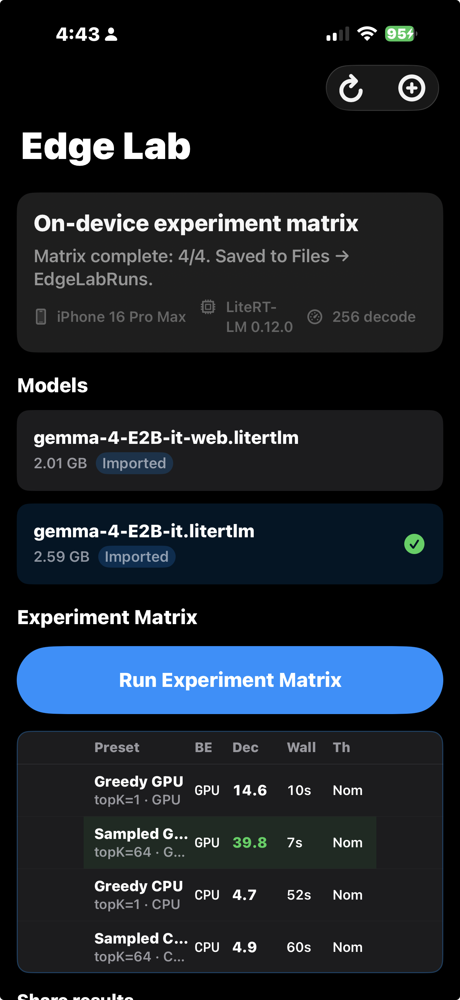

# Edge Lab

**Open on-device experiment matrix for Gemma / LiteRT-LM on iPhone.**

Bring your `.litertlm` model, tap **Run Experiment Matrix**, get a versioned JSON manifest (decode tok/s, TTFT, CPU vs GPU, thermal) — no cloud, no hidden toggles.

> **Why star it?** Reproducible edge-AI benchmarks you can post to GitHub, drop into a blog, or compare across devices — with every sampler and backend choice written into the export.



Launch copy: [docs/LAUNCH_THREAD.md](docs/LAUNCH_THREAD.md)

## Quick start

```bash
git clone https://github.com/AndrewVoirol/edge-lab.git
cd edge-lab
./scripts/setup.sh
open EdgeLab.xcworkspace   # workspace, NOT .xcodeproj
```

1. Import a `.litertlm` model ([BYOM guide](docs/BYOM.md)).
2. **Run Experiment Matrix** (~1–2 min on iPhone 16 Pro Max after first load).
3. **Share** → copy X thread, JSON, or Markdown.

**Tested:** iPhone 16 Pro Max · iOS 26.6 · LiteRT-LM **v0.12.0** (`aeefa9b`) · 256 decode tokens per preset

## Four presets (no Gallery app required)

You do **not** need Google's closed [AI Edge Gallery](https://github.com/google-ai-edge/gallery) app to understand these runs. Names describe **exact settings** logged in JSON:

| Preset | Config | What it measures |
|--------|--------|------------------|
| Greedy GPU | topK=1 · GPU | Deterministic greedy decoding on GPU |
| Sampled GPU | topK=64 · GPU | LiteRT-LM-style sampled decoding on GPU |
| Greedy CPU | topK=1 · CPU | Greedy on CPU (or ↺ GPU if model has no CPU weights) |
| Sampled CPU | topK=64 · CPU | Sampled on CPU |

`requested_backend` vs `backend` + `did_fallback` in the manifest tell you what actually ran.

## Example manifests (real device runs)

| Model | File | Highlight |
|-------|------|-----------|
| Gemma 4 E2B-it | [Examples/gemma-4-E2B-it_matrix_run.json](Examples/gemma-4-E2B-it_matrix_run.json) | ~40 GPU tok/s vs ~5 CPU tok/s (true CPU) |
| Gemma 4 E2B-it-web | [Examples/gemma-4-E2B-it-web_matrix_run.json](Examples/gemma-4-E2B-it-web_matrix_run.json) | GPU_ARTISAN; CPU may ↺ GPU fallback |

## How this differs from AI Edge Gallery

| | Edge Lab | AI Edge Gallery (Google) |
|--|----------|---------------------------|
| Source | Open | Closed iOS ([source requested](https://github.com/google-ai-edge/gallery/issues/420)) |
| Settings | Exported in JSON | Opaque UI |
| Models | BYOM `.litertlm` | Bundled |
| Goal | Reproducible manifests | Consumer demo |

Edge Lab is a **lab instrument**, not a Gallery clone.

## Docs

- [Methodology](docs/METHODOLOGY.md) — warmup, session rules, GPU verification
- [Run format](docs/RUN_FORMAT.md) — schema 1.1
- [BYOM](docs/BYOM.md) — import models

## Links

- [LiteRT-LM](https://github.com/google-ai-edge/LiteRT-LM)
- [Gemma 4 E2B litert-community](https://huggingface.co/litert-community/gemma-4-E2B-it-litert-lm)
- [ableandrew.com](https://ableandrew.com)

## License

Apache-2.0 — see [LICENSE](LICENSE).